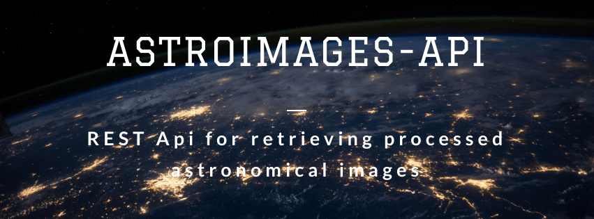

Smoketest runner (smoketest_runner)
=================================


[](#)

CLI app for running a chain of REST API calls


Usage
-----

Clone the repo:

```console
$ git clone https://github.com/rsouza01/smoketest-runner/
$ cd smoketest-runner
```


Create and activate virtualenv:

```console
$ virtualenv -p python3 env
$ source env.sh
(env) $ pip3 install -r requirements.txt
```

## Testing

To run unit tests:

```console
(env) $ python -m unittest discover test/unit -v
```

## Author

**Rodrigo de Souza**

* Website: http://www.rodrigosouza.net.br
* Github: [@rsouza01](https://github.com/rsouza01)
* LinkedIn: [@rsouza01](https://linkedin.com/in/rsouza01)

## Tools

- Banner made with BannerSnack

## Show your support

Give a ⭐️ if this project helped you!


## [References](REFERENCES.md)


License
-------

Smoketest-runner is released under the [MIT License](LICENSE).

